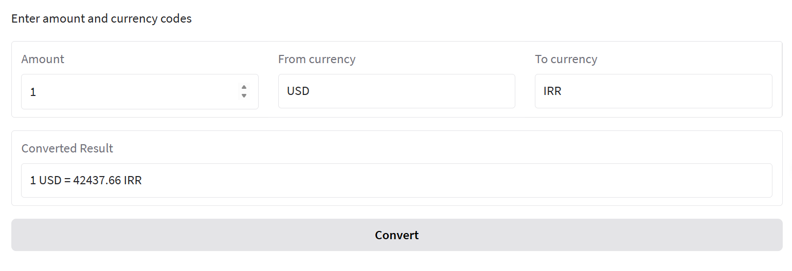

# AI Currency Converter

 

## Overview

AI Currency Converter is a web-based application built with Gradio that allows users to convert currencies in real-time using live exchange rates from the ExchangeRate-API. The project integrates OpenAI's API for potential AI-driven features (e.g., natural language processing for queries) and leverages tools like OpenAI Agents and MCP (Model Control Plane) for advanced functionality. It supports conversions between any two currencies (e.g., USD to IRR) and provides a simple, interactive UI.

This project was developed in a Jupyter Notebook environment and is designed to be deployed as a standalone Gradio app. It's ideal for developers interested in combining AI, APIs, and web interfaces for financial tools.

### Key Features
- **Real-Time Currency Conversion**: Fetch live exchange rates using the ExchangeRate-API.
- **Gradio UI**: User-friendly web interface for inputting amount, source currency, and target currency.
- **AI Integration**: Uses OpenAI API and OpenAI Agents for potential extensions like conversational queries (e.g., "Convert 100 dollars to rials").
- **MCP Support**: Integrates with MCP for streaming and server-side enhancements.
- **Environment Management**: Handles API keys securely via `.env` files.
- **Extensible**: Easily add more AI tools or currencies.

## Requirements

- Python 3.12+ (tested on 3.12.1 and 3.13)
- Jupyter Notebook (for development)
- API Keys:
  - OpenAI API Key (from [OpenAI](https://platform.openai.com/account/api-keys))
  - ExchangeRate-API Key (from [ExchangeRate-API](https://www.exchangerate-api.com/))

### Dependencies
The project uses the following Python packages (installed via pip):
- `openai-agents` (>=0.2.8)
- `gradio` (with MCP support)
- `openai` (>=1.99.6)
- `python-dotenv`
- `requests`
- `httpx`
- `pillow`
- Other implicit deps: `numpy`, `pydantic`, etc. (handled by the main packages)

## Installation

1. **Clone the Repository**:
   ```
   git clone https://github.com/yourusername/ai-currency-converter.git
   cd ai-currency-converter
   ```

2. **Set Up Virtual Environment** (recommended):
   ```
   python -m venv venv
   source venv/bin/activate  # On Windows: venv\Scripts\activate
   ```

3. **Install Dependencies**:
   ```
   pip install --upgrade openai-agents
   pip install -q gradio openai python-dotenv requests httpx pillow
   pip install agents  # For additional agent support
   ```

   If using Python 3.13 specifically:
   ```
   py -3.13 -m pip install openai-agents
   ```

4. **Configure API Keys**:
   Create a `.env` file in the project root with your keys:
   ```
   OPENAI_API_KEY=your_openai_api_key_here
   EXCHANGE_API_KEY=your_exchange_api_key_here
   ```
   **Note**: Do not commit this file to GitHub. Add `.env` to your `.gitignore`.

## Usage

### Running the App Locally

1. **Launch the Gradio Demo**:
   Run the main script or Jupyter notebook cell:
   ```python
   import gradio as gr
   from dotenv import load_dotenv
   import os
   import requests
   import traceback

   load_dotenv()
   EXCHANGE_API_KEY = os.getenv("EXCHANGE_API_KEY")

   def convert_currency(amount: float, from_currency: str, to_currency: str) -> str:
       try:
           url = f"https://v6.exchangerate-api.com/v6/{EXCHANGE_API_KEY}/pair/{from_currency.upper()}/{to_currency.upper()}/{amount}"
           response = requests.get(url)
           data = response.json()
           if response.status_code == 200 and data.get("conversion_result"):
               converted = round(data["conversion_result"], 2)
               return f"{amount} {from_currency.upper()} = {converted} {to_currency.upper()}"
           else:
               return f"Error: {data.get('error-type', 'Unknown error')}"
       except Exception:
           traceback.print_exc()
           return "Conversion failed. Check API key or network."

   def build_demo():
       with gr.Blocks() as demo:
           gr.Markdown("Currency Converter (Live)")
           gr.Markdown("Enter amount and currency codes")
           with gr.Row():
               amount = gr.Number(label='Amount', value=1)
               from_curr = gr.Textbox(label="From currency")
               to_curr = gr.Textbox(label="To currency")
           result = gr.Textbox(label="Converted Result")
           gr.Button("Convert").click(convert_currency, inputs=[amount, from_curr, to_curr], outputs=result)
       return demo

   if __name__ == "__main__":
       print("Starting AI Exchangeable Converter Live: ")
       build_demo().launch(server_name="0.0.0.0", mcp_server=True)
   ```

2. **Access the App**:
   - Open `http://localhost:7867` (or the port shown in the console).
   - Input an amount (e.g., 100), from currency (e.g., USD), to currency (e.g., IRR), and click "Convert".

### Example
- Amount: 1
- From: USD
- To: EUR
- Output: "1 USD = 0.92 EUR" (based on live rates)

### AI Extensions
- The project includes OpenAI Agents and MCP for potential AI features. For example, integrate natural language input:
  ```python
  # Example extension (add to your code)
  from openai import OpenAI
  client = OpenAI(api_key=os.getenv("OPENAI_API_KEY"))
  # Use client to parse user queries like "convert 50 dollars to euros"
  ```

- MCP Setup: The app launches with MCP server enabled for streaming responses.

## Development Notes

- **Jupyter Notebook**: The project originates from a Jupyter notebook. Run cells sequentially to set up the environment.
- **Error Handling**: API errors are caught and displayed. Ensure valid currency codes (ISO 4217, e.g., USD, EUR, IRR).
- **Limitations**:
  - Free ExchangeRate-API has rate limits; upgrade for production.
  - OpenAI features are optional and require credits.
- **Testing**: A sample Gradio interface for letter counting is included as a test (can be removed).

## Contributing

Contributions are welcome! Fork the repo, create a branch, and submit a pull request. Focus on:
- Adding more AI features (e.g., voice input via OpenAI).
- Supporting more APIs or currencies.
- Improving UI/UX.

Please follow standard GitHub workflows and include tests.

## License

This project is licensed under the MIT License. See [LICENSE](LICENSE) for details.

---

*Built with ❤️ using Python, Gradio, and OpenAI. For questions, open an issue on GitHub.*
